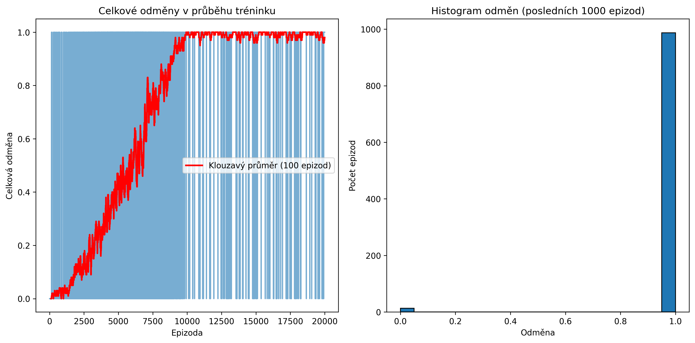

# Projekt: Reinforcement Learning - Q-learning pro FrozenLake

Tento projekt je implementací algoritmu Q-learning pro řešení prostředí "FrozenLake-v1" z knihovny `gymnasium`. Byl vypracován v rámci kurzu AI Agenti.

## 📋 Popis

Agent se pomocí Q-tabulky učí optimální politiku (cestu) v mřížkovém světě 4x4. Cílem je dostat se z počátečního stavu (S) do cílového stavu (G) bez pádu do díry (H).

### Mapa prostředí:

SFFF
FHFH
FFFH
HFFG

- S: Start (počáteční pozice)
- F: Frozen (zmrzlá plocha - bezpečná)
- H: Hole (díra - konec hry)
- G: Goal (cíl - vítězství)

## 🎯 Výsledky tréninku

Agent se úspěšně naučil řešit úkol s vysokou úspěšností po 20 000 trénovacích epizodách. Skript automaticky ukládá následující výstupy do složky `vysledky/`:

- **Graf učení** - vizualizace průběhu tréninku a histogram odměn
- **Q-tabulka** - naučené hodnoty ve formátu `.npy`
- **Statistiky** - detailní výsledky tréninku v textovém souboru



## 🚀 Jak spustit projekt

### 1. Naklonujte repozitář:
```bash
git clone https://github.com/88barcode88/Kurz_AIAgents_Ukoly.git
cd Kurz_AIAgents_Ukoly/Lekce_10

2. Vytvořte a aktivujte virtuální prostředí:

Windows:

# Vytvoření
python -m venv venv

# Aktivace
.\venv\Scripts\activate

Linux/Mac:

# Vytvoření
python3 -m venv venv

# Aktivace
source venv/bin/activate

3. Nainstalujte potřebné knihovny:

pip install -r requirements.txt

4. Spusťte hlavní skript:

python trenovani.py

Po spuštění se zobrazí:

Průběžné informace o tréninku
Graf s výsledky učení
Vizuální demonstrace naučeného agenta (5 epizod)
Všechny výsledky se automaticky uloží do složky vysledky/

📦 Struktura projektu

Lekce_10/
│
├── trenovani.py          # Hlavní skript s implementací Q-learning
├── requirements.txt      # Seznam potřebných knihoven
├── README.md            # Tento soubor
│
└── vysledky/            # Složka s výsledky (vytvoří se automaticky)
    ├── graf_uceni_*.png
    ├── q_tabulka_*.npy
    └── statistiky_*.txt

🛠️ Použité technologie

Python 3.8+
gymnasium - prostředí pro reinforcement learning
numpy - numerické výpočty a Q-tabulka
matplotlib - vizualizace výsledků

📊 Hyperparametry

Počet epizod: 20 000
Learning rate (α): 0.1
Discount factor (γ): 0.99
Epsilon-greedy strategie:
Počáteční epsilon: 1.0
Minimální epsilon: 0.01
Decay rate: 0.0001

📝 Poznámky
Prostředí je nastaveno s parametrem is_slippery=False pro deterministické chování
Agent používá epsilon-greedy strategii pro vyvážení explorace a exploitace
Q-hodnoty se aktualizují pomocí Bellmanovy rovnice

👤 Autor
Vytvořeno v rámci kurzu AI Agenti 
Miroslav Coufalík

📄 Licence

Tento projekt je určen pro vzdělávací účely.